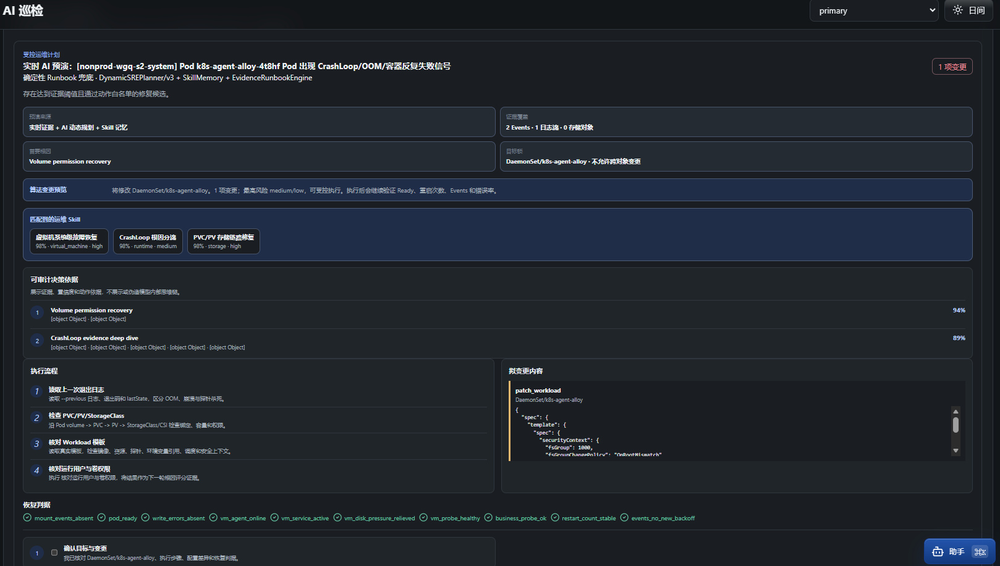
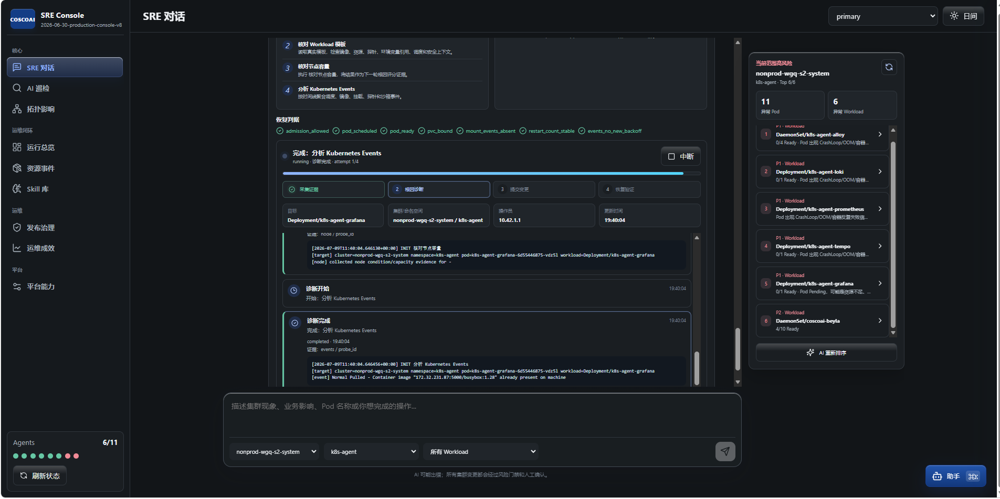
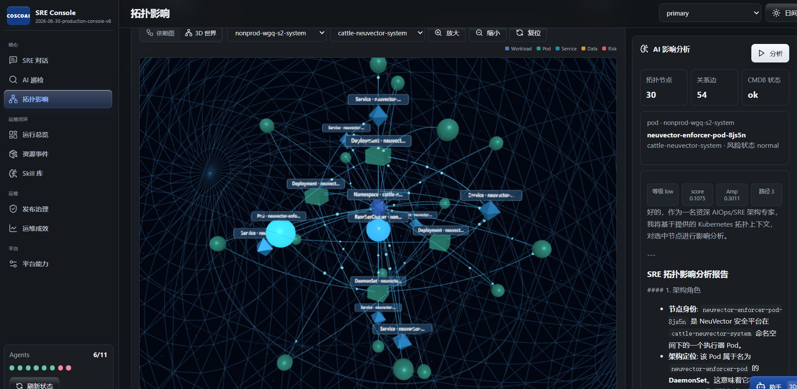

# Flawless

[](#quick-start)
[](#development)
[](#kubernetes-deployment)
[](#docker)
[](#langfuse)
[](#license)

**Your infrastructure can explain itself, heal safely, and prove it recovered.**<br>

**Flawless** is an AI-native SRE control plane for Kubernetes and cloud infrastructure. It connects alerts, evidence, topology, human approval, controlled remediation, and recovery verification in one auditable AgenticOps loop.

It's not just another operations chat box that only gives advice.。Flawless This connects "problem discovery, evidence collection, simulation generation, manual authorization, change execution, recovery verification, and experience accumulation" into an auditable closed loop.

Created in Shanghai by **陆宣宇 (Xuanyu Lu)**.


## Product Preview \

These are real console captures from the running platform, not conceptual mockups.

| AI inspection and executable preview | SRE conversation and live evidence |
|---|---|
|  |  |



Current release: **3.2.0**.

Release 3.2 adds persistent remediation lineage: every failed strategy, action,
verification result, and replacement plan stays linked across operator-approved
follow-up jobs. The effectiveness ledger is persisted on the runtime volume so
model comparisons and recovery records survive Pod restarts.

> **Compatibility note:** the public product name is **Flawless**. Existing
> `LUXYAI_*` environment variables, the `charts/luxyai` directory, storage
> paths, and Kubernetes resource identifiers remain supported so current
> installations can upgrade without a destructive migration.


## The AgenticOps Loop

`discover → diagnose → preview → approve → execute → verify → learn`

- **Evidence first**: connect alerts, events, logs, metrics, topology, runbooks, and recent changes.
- **Guarded action**: keep RBAC, policy, dry-run, human approval, and audit outside the model boundary.
- **Verified recovery**: test the original symptom after execution instead of treating a successful command as success.

## Field Notes / 实战手记

Only published notes are listed below; links point to versioned files in this repository:

- [From Alert to Verified Recovery (blog/posts/2026-07-13-from-alert-to-verified-recovery.md)
- [Should AI Be Allowed to Fix Kubernetes? / Can AI fix Kubernetes?？](blog/posts/2026-07-13-ai-should-earn-the-right-to-act.md)
- [The Next SRE Control Plane Is More Than a Chat Box / Next-generation SRE control plane (blog/posts/2026-07-13-not-another-chatbox.md)
- [Building AgenticOps from Shanghai /buildingAgenticOps](blog/posts/2026-07-13-building-agenticops-in-shanghai.md)

## Why This Exists

Modern cloud systems fail in ways that are hard to reason about from a single log line:

- a Pod restart can hide a PVC, image, scheduling, network, quota, or rollout issue;
- a small workload change can affect services, data pipelines, middleware, and downstream users;
- repeated human firefighting leaves valuable operational knowledge outside the platform;
- model output is useful only when it is constrained by evidence, policy, permissions, and rollback.

Flawless is built as an SRE control plane. It uses a model as a planner and explainer, but the platform keeps the execution boundary: RBAC, action catalog, dry-run, approval, audit, and recovery verification.

## Core Features

- **SRE Chat**: ChatGPT-style operations console with cluster, namespace, workload, and risk context.
- **Inspection Queue**: scheduled or manual scans across Rancher/Kubernetes scopes with severity ranking.
- **Controlled Remediation**: evidence collection, change preview, human approval, execution, post-change verification, and evidence-driven replanning that remembers failed strategies across follow-up jobs.
- **Topology Impact**: 2D/3D topology, CMDB-style dependencies, eBPF/data-flow adapters, blast-radius analysis.
- **Release Governance**: SLO, error budget, canary/risk gate, emergency fix path, and release audit chain.
- **Skills Library**: portable operation skills that encode expert knowledge and can be reused by other agents.
- **Knowledge Base**: upload text, Markdown, PDF, Word, Excel, logs, YAML, and runbooks for operations RAG.
- **Model Lab**: configure multiple OpenAI-compatible or OAuth-protected model gateways and compare outcomes.
- **Measurable Outcomes**: persistent remediation lineage, changed-resource history, recovery evidence, and model effectiveness comparisons.
- **Observability**: Prometheus metrics, Loki logs, Tempo traces, Grafana links, and optional Langfuse traces.
- **Extensible Infrastructure**: adapters for Kubernetes, Rancher, databases, virtual machines, storage, and middleware.

## Architecture

```text
Frontend Console
  ├─ SRE Chat / Inspection / Topology / Release / Skills / Models
  │
  ▼
Control Plane API
  ├─ Evidence pipeline
  ├─ Remediation job state machine
  ├─ Release gate and SLO budget
  ├─ Knowledge and model registries
  ├─ Observability store
  └─ Integration health checks
  │
  ├─ MCP Kubernetes tools
  ├─ A2A healing / incident / postmortem agents
  ├─ Rancher / Prometheus / CMDB / eBPF flow adapters
  ├─ Langfuse / Loki / Tempo / Grafana adapters
  └─ Optional custom algorithm extension
```

## Quick Start

The quick-start command performs prerequisite checks, creates `.env` when
needed, builds the console, starts the API plus all local agents/MCP services,
and waits for the complete core health check to pass.

You need either:

- Docker Engine or Docker Desktop with Compose v2; or
- Python 3.11+ and Node.js 20+ for the automatic native fallback.

### One-Click Deployment

```bash
git clone https://github.com/jdgiles26/Flawless.git
cd Flawless
./scripts/quickstart.sh
```

Open `http://127.0.0.1:8080` after the command reports `ready`.

For mainland China package and image mirrors:

```bash
./scripts/quickstart.sh --china
```

Useful controls:

```bash
./scripts/quickstart.sh status
./scripts/quickstart.sh logs
./scripts/quickstart.sh stop
./scripts/quickstart.sh --port 18080 --open
./scripts/quickstart.sh --mode native
./scripts/quickstart.sh --mode docker
```

`auto` mode prefers Docker when its daemon is running and otherwise uses the
native toolchain. Runtime data and logs stay under `.flawless/` in native mode
or in the `flawless-data` Docker volume. Re-running the command is safe.

### Model Configuration

The console and baseline workflows start without a live model endpoint. To use
AI chat, configure `.env` for an OpenAI-compatible local endpoint such as
Ollama, then restart the stack:

```env
LLM_API_BASE=http://localhost:11434/v1
LLM_API_KEY=ollama
LLM_MODEL=qwen2.5:7b
LLM_AUTH_TYPE=api_key
```

In Docker mode, the quick-start script automatically maps `localhost` model
URLs to `host.docker.internal`. For an OAuth client-credentials gateway:

```env
LLM_AUTH_TYPE=oauth_client_credentials
OAUTH_TOKEN_URL=https://your-iam/realms/main/protocol/openid-connect/token
OAUTH_CLIENT_ID=your-client
OAUTH_CLIENT_SECRET=your-secret
LLM_API_BASE=https://your-llm-gateway/engines/default
LLM_MODEL=your-model
LLM_VERIFY_SSL=true
```

### Kubernetes Access

The local console can start without Kubernetes credentials. In that state the
UI, API, agents, MCP gateway, and dry-run planning are available, while cluster
tools return a clear `Kubernetes access is not configured` response.

Native mode automatically reads `KUBECONFIG` or `~/.kube/config`:

```bash
./scripts/quickstart.sh --mode native
```

Docker mode intentionally does not mount host cluster credentials by default.
For a real cluster, use the Kubernetes/Helm deployment below so the workloads
receive a scoped ServiceAccount, or explicitly provide a read-only kubeconfig
mount appropriate for your local cluster.

## Docker

The one-click command uses [`compose.yaml`](compose.yaml) automatically when
Docker is available. The Compose service builds one image, runs the complete
local service group, persists runtime state, and publishes only the console on
the loopback interface.

Direct Compose usage is also supported:

```bash
cp .env.example .env
docker compose up -d --build
docker compose ps
```

Or build and run the all-in-one image without Compose:

```bash
docker build --target backend-runtime -t flawless:latest .
docker run --rm \
  --env-file .env \
  --add-host host.docker.internal:host-gateway \
  -p 127.0.0.1:8080:8080 \
  -v flawless-data:/var/lib/flawless \
  flawless:latest
```

Push to GHCR or an internal registry:

```bash
IMAGE=ghcr.io/jdgiles26/flawless:latest ./scripts/build-push.sh
```

For air-gapped or China mainland networks, the `Dockerfile` and `scripts/build-push.sh` already expose mirror build args:

```bash
NODE_IMAGE=docker.m.daocloud.io/library/node:24-slim \
PYTHON_IMAGE=docker.m.daocloud.io/library/python:3.13-slim \
NPM_REGISTRY=https://registry.npmmirror.com \
PIP_INDEX_URL=https://mirrors.aliyun.com/pypi/simple \
IMAGE=your-registry/flawless:latest \
./scripts/build-push.sh
```

## Kubernetes Deployment

### Recommended: Helm

The chart installs the control plane, six agent services, controlled cluster-wide
RBAC, Generic NAS persistence, NodePort access, optional Ingress, and Secret hooks:

```bash
kubectl create namespace k8s-agent

helm upgrade --install flawless ./charts/luxyai \
  --namespace k8s-agent \
  --set image.repository='<internal-registry>/flawless' \
  --set image.tag='<release-tag>' \
  --set persistence.storageClass=standard
```

Use `rbac.mode=controlled` in production. `rbac.mode=cluster-admin` exists only
for isolated validation environments and should require a security exception.

Render and review before deployment:

```bash
helm lint ./charts/luxyai --strict
helm template flawless ./charts/luxyai -n k8s-agent > rendered.yaml
```

### Raw Manifests

#### 1. Create Namespace

```bash
kubectl create namespace k8s-agent
```

#### 2. Create Secrets

Do not commit real secrets. Create them from your terminal or secret manager:

```bash
kubectl -n k8s-agent create secret generic k8s-agent-oauth \
  --from-literal=OAUTH_CLIENT_ID='<client-id>' \
  --from-literal=OAUTH_CLIENT_SECRET='<client-secret>' \
  --from-literal=RANCHER_TOKEN='<optional-rancher-token>'
```

For Langfuse:

```bash
kubectl -n k8s-agent create secret generic k8s-agent-langfuse \
  --from-literal=public-key='<pk-lf-...>' \
  --from-literal=secret-key='<sk-lf-...>'
```

Administrator configuration is disabled by default. The password must never be
stored in `values.yaml`, a ConfigMap, or the repository:

```bash
kubectl -n k8s-agent create secret generic luxyai-console-auth \
  --from-literal=CONSOLE_BASIC_AUTH_USERNAME='admin' \
  --from-literal=CONSOLE_BASIC_AUTH_PASSWORD='<password-from-vault>'

helm upgrade --install flawless ./charts/luxyai \
  -n k8s-agent \
  --reuse-values \
  --set admin.enabled=true
```

When admin mode is off, the console remains readable and operational approvals
continue to work, but model, knowledge, and Skill writes are blocked. When it is
on, those three write surfaces require the Secret-backed administrator identity.

#### 3. Configure Runtime

Edit `manifests/deployment.yaml`:

- `LLM_AUTH_TYPE`
- `OAUTH_TOKEN_URL`
- `LLM_API_BASE` / `LLM_GATEWAY_BASE`
- `LLM_MODEL`
- `PROMETHEUS_URL`
- `CMDB_URL`
- `RANCHER_URL`
- `RANCHER_CLUSTER_IDS`
- `ALLOWED_NAMESPACES`
- `OPS_MUTATION_ENABLED`
- `AUTO_HEALING_ENABLED`

#### 4. Apply Manifests

```bash
kubectl apply -f manifests/rbac.yaml
kubectl apply -f manifests/deployment.yaml
kubectl apply -f manifests/frontend.yaml
```

The default service exposes the console through NodePort `30080`:

```bash
kubectl get svc -n k8s-agent
```

For production, use your company Ingress/Gateway with TLS and identity middleware instead of exposing an unauthenticated public NodePort.

## Model Configuration

Flawless supports two common model access patterns.

### OAuth Token URL + Base URL

Use this when your gateway requires a dynamic bearer token:

```json
[
  {
    "id": "primary",
    "provider": "oauth-gateway",
    "model": "your-model",
    "base_url": "https://your-gateway/engines/default",
    "auth_type": "oauth_client_credentials",
    "token_url": "https://your-iam/token",
    "client_id": "your-client",
    "client_secret": "from-secret",
    "role": "primary",
    "max_tokens": 4096,
    "verify_ssl": true
  }
]
```

### Base URL + API Key

Use this for OpenAI-compatible providers:

```json
[
  {
    "id": "openai-compatible",
    "provider": "openai-compatible",
    "model": "your-model",
    "base_url": "https://api.example.com/v1",
    "auth_type": "api_key",
    "api_key": "from-secret",
    "role": "candidate",
    "max_tokens": 4096
  }
]
```

Set the JSON in `MODEL_PROFILES_JSON` or add models from the **Model Lab** page. Secrets should come from Kubernetes Secret or your enterprise secret platform.

## Langfuse

Langfuse is optional. When configured, the platform records model calls, latency, token usage, cost estimates, tool spans, quality scores, and trace IDs.

Environment variables:

```env
LANGFUSE_ENABLED=true
LANGFUSE_HOST=http://langfuse-web.langfuse.svc.cluster.local:3000
LANGFUSE_PUBLIC_KEY=pk-lf-...
LANGFUSE_SECRET_KEY=sk-lf-...
```

Deployment references:

- Docker Compose: https://langfuse.com/self-hosting/deployment/docker-compose
- Kubernetes Helm: https://langfuse.com/self-hosting/deployment/kubernetes-helm

This repository also contains `manifests/langfuse-local.yaml` as a local reference manifest. It is ignored by Git by default because production Langfuse credentials and storage settings should be managed separately.

## Custom Algorithm Extension

The public repository includes a runnable baseline algorithm module at `agents/aiops_algorithms.py`.

If you have a custom scoring implementation, keep it outside the repository and load it at runtime:

```bash
export LUXYAI_CUSTOM_ALGORITHM_PATH=.local/custom_algorithms/aiops_algorithms_custom.py
uvicorn backend.app.main:app --host 0.0.0.0 --port 8080
```

Docker:

```bash
docker run --rm \
  --env-file .env \
  -e LUXYAI_CUSTOM_ALGORITHM_PATH=/var/lib/luxyai-custom/aiops_algorithms_custom.py \
  -v "$PWD/.local/custom_algorithms:/var/lib/luxyai-custom:ro" \
  -p 8080:8080 \
  flawless:latest \
  python -m uvicorn backend.app.main:app --host 0.0.0.0 --port 8080
```

Kubernetes:

```bash
kubectl -n k8s-agent create secret generic luxyai-custom-algorithms \
  --from-file=aiops_algorithms_custom.py=.local/custom_algorithms/aiops_algorithms_custom.py
kubectl rollout restart deploy/luxyai -n k8s-agent
kubectl rollout restart deploy/k8s-agent-api -n k8s-agent
```

If the secret is absent, the platform still runs with the open baseline.

To explicitly test the open baseline path:

```bash
LUXYAI_DISABLE_CUSTOM_ALGORITHMS=1 uvicorn backend.app.main:app --host 0.0.0.0 --port 8080
```

## Skills

Skills are portable operational knowledge packages. They describe:

- symptoms and trigger conditions;
- required evidence;
- allowed objects;
- allowed actions;
- recovery criteria;
- rollback guidance;
- optional references and runbooks.

Skills are stored under `OPS_SKILL_ROOT` and can be created from the console. They are intentionally portable so they can be reused by other agents or moved between environments.

Each Skill is persisted as an independent package directory, rather than being
compiled into the application. This keeps the Skill repository separately
versionable, reviewable, exportable, and reusable by other compatible agents.

## Unified Resource API

`GET /api/resources` exposes Kubernetes, databases, virtual machines,
middleware, storage, and cloud resources through one stable contract:

```text
GET /api/resources?resource_type=pod&cluster=prod&namespace=orders&limit=200
```

The response uses contract `luxyai.resource.v1`, includes source and health
summaries, and supports cursor pagination. New infrastructure teams should add
an adapter and normalize into this contract instead of introducing a parallel
resource API.

## Safety Model

The platform is designed around least privilege:

- no browser-side shell or arbitrary command execution;
- no mutation unless server switches allow it;
- high-risk actions require explicit operator confirmation;
- action catalog limits what the model can request;
- namespace/workload scope is controlled by RBAC and allowlists;
- every change records preview, actor, diff, result, and verification status;
- secrets are never committed and should be supplied through Kubernetes Secret or a secret manager.

## Repository Layout

```text
Flawless/
├── agents/                  # SRE workflow agents and execution engines
├── backend/app/             # Control plane API, schemas, services, domain logic
├── mcp_servers/             # Kubernetes MCP tools
├── cmdb/                    # Local CMDB/topology service
├── cloud/                   # Cloud and infrastructure adapter contracts
├── frontend/modern/         # React + TypeScript + Vite console
├── charts/luxyai/      # Production Helm chart
├── manifests/               # Kubernetes manifests
├── scripts/                 # Build and image helper scripts
├── docs/                    # Architecture and maintainer documentation
├── examples/                # Sample alerts
└── tests/                   # Backend and workflow tests
```

## Development

```bash
python -m compileall -q backend agents mcp_servers cmdb cloud a2a openwebui
python -m unittest discover -s tests -v
cd frontend/modern && npm run build
```

Run the security gate locally:

```bash
python -m pip install pip-audit
pip-audit -r requirements.lock --no-deps --disable-pip
```

## GitHub

The public engineering baseline lives at
[`jdgiles26/Flawless`](https://github.com/jdgiles26/Flawless). Custom algorithm
extensions, credentials, production topology, and company data are loaded at
runtime and are intentionally excluded from the public repository.

## Roadmap

Flawless is designed to grow from a Kubernetes SRE console into an AgenticOps operating system for modern infrastructure.

- **Kubernetes Autopilot**: cover the full lifecycle from alert, evidence, root-cause analysis, remediation preview, approval, execution, rollback, and recovery verification.
- **Rancher Multi-Cluster Fleet**: make every cluster, namespace, workload, event, metric, and operation record searchable and governable from one control plane.
- **Full-Stack Infrastructure Operations**: extend the same evidence-to-action loop to databases, virtual machines, storage, middleware, ingress, service mesh, and hybrid-cloud resources.
- **Runtime Data-Flow Intelligence**: fuse Kubernetes inventory, CMDB, Prometheus, Loki, Tempo, and eBPF flow data into a living dependency graph that explains impact, blast radius, and traffic direction.
- **Release Governance Control Plane**: turn SLO, error budget, canary scope, image risk, YAML policy, topology risk, and emergency repair paths into a programmable release gate.
- **Operations Skills Network**: let engineers package hard-won troubleshooting experience as portable Skills, so the platform becomes stronger every time an incident is solved.
- **Model Benchmark Arena**: evaluate different models by remediation success rate, MTTR reduction, safety score, evidence quality, token cost, and rollback correctness.
- **Digital Twin for Change Risk**: simulate changes against topology, historical incidents, dependency paths, and SLO budgets before production is touched.
- **100k-Node Scale Architecture**: move heavy discovery to event-driven collectors, sharded caches, async job queues, streaming evidence pipelines, and pluggable stores.
- **Enterprise Trust Layer**: ship production Helm charts, air-gapped packages, OIDC/SSO, RBAC presets, audit retention, policy-as-code, secret-manager integration, and compliance reports.
- **Cloud & Edge Expansion**: add first-class adapters for Alibaba Cloud, Generic Cloud, Tencent Cloud, AWS, Azure, private cloud, edge clusters, and cross-region disaster recovery.
- **Self-Healing Platform Runtime**: let the platform inspect and repair its own agents, collectors, queues, stores, and integrations under strict approval and audit boundaries.

## License

This project is released under the standardized
[PolyForm Noncommercial License 1.0.0](LICENSE).

You may use, study, modify, and redistribute the source code for non-commercial purposes. Commercial use, hosted commercial services, resale, enterprise product bundling, paid support services, and removal of author attribution require prior written authorization from **陆宣宇 (Xuanyu Lu)**.

This is a standardized source-available non-commercial license, not an
OSI-approved open-source license. Commercial authorization requests can be sent
to the repository owner through GitHub.
